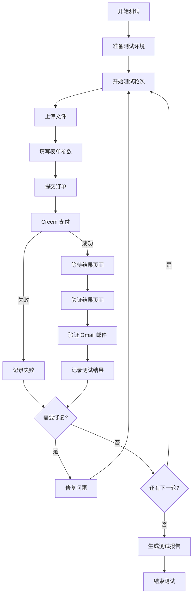
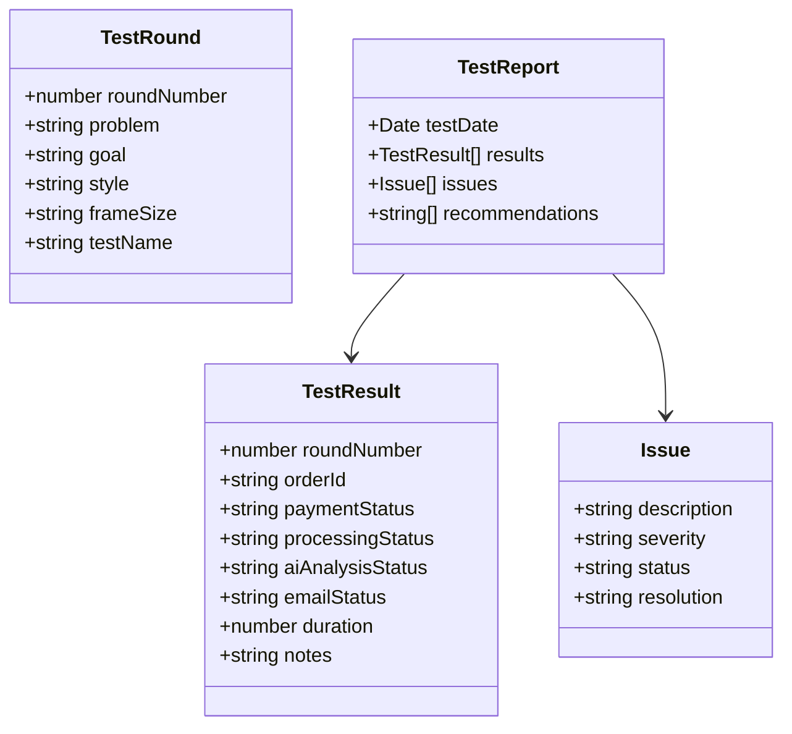

# 设计文档：Creem 支付流程测试

## 概述

本设计文档描述了 FPVTune 网站 Creem 支付流程端到端测试的技术实现方案。测试系统将使用 Playwright 进行浏览器自动化测试，验证从文件上传到邮件接收的完整支付流程。

测试系统包含以下核心功能：
- 自动化浏览器测试（使用 Playwright MCP）
- 10 轮不同参数组合的测试执行
- Gmail 邮件内容验证
- 测试结果记录和报告生成
- 问题发现和修复流程

技术栈：
- Playwright MCP（浏览器自动化）
- TypeScript（测试脚本）
- Gmail（邮件验证）

## 架构

### 测试流程图



### 测试数据结构



## 组件和接口

### 1. 测试配置

```typescript
// 测试环境配置
interface TestConfig {
  baseUrl: string;           // https://fpvtune.com
  tunePath: string;          // /zh/tune
  testEmail: string;         // ningainshop@gmail.com
  testCardNumber: string;    // 4242424242424242
  testCardExpiry: string;    // 任意未来日期
  testCardCVC: string;       // 任意3位数
  testVerifyCode: string;    // 000000
  timeout: number;           // 60000ms
}

// 测试轮次配置
interface TestRound {
  roundNumber: number;
  problem: 'propwash' | 'vibration' | 'motor_hot' | 'bounce_back';
  goal: 'locked' | 'responsive' | 'smooth';
  style: 'freestyle' | 'racing' | 'cinematic';
  frameSize: '3"' | '5"' | '7"';
  testName: string;
}

// 10轮测试参数
const TEST_ROUNDS: TestRound[] = [
  { roundNumber: 1, problem: 'propwash', goal: 'locked', style: 'freestyle', frameSize: '5"', testName: 'Test Round 1' },
  { roundNumber: 2, problem: 'vibration', goal: 'responsive', style: 'racing', frameSize: '5"', testName: 'Test Round 2' },
  { roundNumber: 3, problem: 'motor_hot', goal: 'smooth', style: 'cinematic', frameSize: '7"', testName: 'Test Round 3' },
  { roundNumber: 4, problem: 'bounce_back', goal: 'locked', style: 'racing', frameSize: '5"', testName: 'Test Round 4' },
  { roundNumber: 5, problem: 'propwash', goal: 'responsive', style: 'freestyle', frameSize: '5"', testName: 'Test Round 5' },
  { roundNumber: 6, problem: 'vibration', goal: 'smooth', style: 'cinematic', frameSize: '3"', testName: 'Test Round 6' },
  { roundNumber: 7, problem: 'motor_hot', goal: 'locked', style: 'freestyle', frameSize: '5"', testName: 'Test Round 7' },
  { roundNumber: 8, problem: 'bounce_back', goal: 'responsive', style: 'racing', frameSize: '5"', testName: 'Test Round 8' },
  { roundNumber: 9, problem: 'propwash', goal: 'smooth', style: 'cinematic', frameSize: '7"', testName: 'Test Round 9' },
  { roundNumber: 10, problem: 'vibration', goal: 'locked', style: 'freestyle', frameSize: '5"', testName: 'Test Round 10' },
];
```

### 2. 测试文件配置

```typescript
// 测试文件路径
interface TestFiles {
  blackboxFile: string;  // public/test bll txt/BTFL_BLACKBOX_LOG_20260113_154353_JHEF745V2五寸竞速胶带.BBL
  cliDumpFile: string;   // public/test bll txt/BTFL_cli_20260113_154510_JHEF745V2五寸竞速胶带.txt
}
```

### 3. 测试结果记录

```typescript
// 测试结果
interface TestResult {
  roundNumber: number;
  orderId: string | null;
  paymentStatus: 'OK' | 'FAIL' | 'PENDING';
  processingStatus: 'OK' | 'FAIL' | 'PENDING';
  aiAnalysisStatus: 'OK' | 'FAIL' | 'PENDING';
  emailStatus: 'OK' | 'FAIL' | 'PENDING';
  emailVerified: boolean;
  duration: number;  // 秒
  notes: string;
  timestamp: Date;
}

// 问题记录
interface Issue {
  roundNumber: number;
  description: string;
  severity: 'critical' | 'major' | 'minor';
  status: 'open' | 'fixed' | 'wontfix';
  resolution?: string;
  timestamp: Date;
}

// 测试报告
interface TestReport {
  testDate: Date;
  totalRounds: number;
  passedRounds: number;
  failedRounds: number;
  results: TestResult[];
  issues: Issue[];
  recommendations: string[];
}
```

## 数据模型

### 测试步骤流程

```typescript
// 单轮测试步骤
enum TestStep {
  NAVIGATE = 'navigate',           // 访问页面
  UPLOAD_BLACKBOX = 'upload_blackbox',  // 上传 Blackbox 文件
  UPLOAD_CLI = 'upload_cli',       // 上传 CLI Dump 文件
  SELECT_PROBLEM = 'select_problem',    // 选择问题类型
  SELECT_GOAL = 'select_goal',     // 选择目标
  SELECT_STYLE = 'select_style',   // 选择风格
  SELECT_FRAME = 'select_frame',   // 选择机架尺寸
  FILL_EMAIL = 'fill_email',       // 填写邮箱
  FILL_NAME = 'fill_name',         // 填写姓名
  SUBMIT = 'submit',               // 提交表单
  PAYMENT = 'payment',             // 完成支付
  WAIT_RESULT = 'wait_result',     // 等待结果
  VERIFY_RESULT = 'verify_result', // 验证结果页面
  VERIFY_EMAIL = 'verify_email',   // 验证邮件
}
```

### 参数映射

```typescript
// 问题类型映射（中英文）
const PROBLEM_MAP = {
  propwash: '桨洗',
  vibration: '振动',
  motor_hot: '电机过热',
  bounce_back: '弹跳',
};

// 目标映射
const GOAL_MAP = {
  locked: '锁定感',
  responsive: '响应速度',
  smooth: '平滑',
};

// 风格映射
const STYLE_MAP = {
  freestyle: '花飞',
  racing: '竞速',
  cinematic: '航拍',
};

// 机架尺寸映射
const FRAME_SIZE_MAP = {
  '3"': '3寸',
  '5"': '5寸',
  '7"': '7寸',
};
```


## 正确性属性

正确性属性是关于系统应该做什么的形式化陈述。每个属性都是一个应该在所有有效执行中保持为真的特征或行为。属性是人类可读规范和机器可验证正确性保证之间的桥梁。

### 属性 1：参数组合正确记录

*对于任何*测试轮次中选择的参数组合（问题类型、目标、风格、机架尺寸），提交表单后系统应该正确记录所有选择的参数，并在后续流程中使用这些参数。

**验证：需求 3.5**

### 属性 2：Webhook 全自动处理

*对于任何*成功支付的订单，Creem Webhook 应该自动触发订单处理流程，无需任何手动干预。系统应该在 60 秒内完成订单处理，包括 Webhook 接收、AI 分析生成和状态更新。

**验证：需求 5.1, 5.2, 5.3**

### 属性 3：订单号格式和一致性

*对于任何*生成的订单号，应该符合格式 `FPV-YYYYMMDD-XXXXXX`，并且在结果页面、邮件主题和邮件正文中保持一致。

**验证：需求 5.4, 7.2, 7.7**

### 属性 4：AI 分析内容完整性

*对于任何*完成的订单，AI 分析报告应该包含针对所选问题类型的调参建议，并考虑用户选择的目标和风格。分析内容在结果页面和邮件中应该保持一致。

**验证：需求 6.3, 6.4, 7.3, 7.8**

### 属性 5：邮件发送时间限制

*对于任何*完成处理的订单，系统应该在订单处理完成后 5 分钟内发送结果邮件到用户邮箱。

**验证：需求 7.5**

### 属性 6：测试结果完整性

*对于任何*完成的测试轮次，系统应该记录完整的测试结果，包括订单号、支付状态、处理状态、AI 分析状态、邮件状态和耗时。

**验证：需求 9.2, 9.3, 10.1**

## 错误处理

### 文件上传错误

```typescript
// 错误类型
type UploadError =
  | { type: 'file_not_found'; path: string }
  | { type: 'invalid_format'; expected: string[]; actual: string }
  | { type: 'upload_timeout'; timeout: number }
  | { type: 'upload_failed'; message: string };

// 错误处理
function handleUploadError(error: UploadError): void {
  console.error(`上传错误: ${error.type}`);
  // 记录问题并暂停测试
  recordIssue({
    description: `文件上传失败: ${JSON.stringify(error)}`,
    severity: 'major',
    status: 'open',
  });
}
```

### 支付错误

```typescript
// 支付错误类型
type PaymentError =
  | { type: 'payment_timeout'; timeout: number }
  | { type: 'payment_declined'; reason: string }
  | { type: 'redirect_failed'; url: string }
  | { type: 'verification_failed'; code: string };

// 错误处理
function handlePaymentError(error: PaymentError): void {
  console.error(`支付错误: ${error.type}`);
  // 记录问题并允许重试
  recordIssue({
    description: `支付失败: ${JSON.stringify(error)}`,
    severity: 'critical',
    status: 'open',
  });
}
```

### Webhook 处理错误

```typescript
// Webhook 错误类型
type WebhookError =
  | { type: 'webhook_not_triggered'; orderId: string; timeout: number }
  | { type: 'webhook_timeout'; timeout: number }
  | { type: 'processing_failed'; orderId: string; message: string }
  | { type: 'ai_analysis_failed'; orderId: string; message: string }
  | { type: 'manual_intervention_required'; orderId: string };

// 错误处理
function handleWebhookError(error: WebhookError): void {
  console.error(`Webhook 错误: ${error.type}`);

  // 如果需要手动干预，标记为严重问题
  if (error.type === 'webhook_not_triggered' || error.type === 'manual_intervention_required') {
    recordIssue({
      description: `Webhook 未自动触发，需要修复: ${JSON.stringify(error)}`,
      severity: 'critical',
      status: 'open',
    });
    // 暂停测试，等待修复
    throw new Error('Webhook 必须全自动处理，不能手动触发');
  }

  recordIssue({
    description: `订单处理失败: ${JSON.stringify(error)}`,
    severity: 'critical',
    status: 'open',
  });
}
```

### 邮件验证错误

```typescript
// 邮件错误类型
type EmailError =
  | { type: 'email_not_found'; orderId: string; timeout: number }
  | { type: 'email_content_invalid'; orderId: string; missing: string[] }
  | { type: 'link_broken'; url: string };

// 错误处理
function handleEmailError(error: EmailError): void {
  console.error(`邮件错误: ${error.type}`);
  // 记录问题
  recordIssue({
    description: `邮件验证失败: ${JSON.stringify(error)}`,
    severity: 'major',
    status: 'open',
  });
}
```

## 测试策略

### 双重测试方法

本测试系统采用手动验证和自动化测试相结合的方法：

- **自动化测试**：使用 Playwright MCP 执行浏览器自动化测试
- **手动验证**：Gmail 邮件内容验证需要人工确认
- 两者互补，确保全面的测试覆盖

### 测试执行流程

1. **准备阶段**
   - 确认测试文件存在
   - 确认网站可访问
   - 准备测试数据

2. **执行阶段**
   - 按顺序执行 10 轮测试
   - 每轮测试完成后记录结果
   - 发现问题时暂停并记录
   - **关键：Webhook 必须全自动触发，不能手动干预**

3. **验证阶段**
   - 验证结果页面内容
   - **等待 Webhook 自动处理完成**（最长 60 秒）
   - 登录 Gmail 验证邮件
   - 验证邮件链接可访问

4. **报告阶段**
   - 生成测试报告
   - 记录发现的问题
   - 提出优化建议

### 全自动流程要求

**重要**：整个支付流程必须全自动完成，不能有任何手动干预：

1. 用户提交表单 → 自动跳转 Creem 支付页面
2. 完成支付 → 自动返回结果页面
3. Creem 发送 Webhook → 系统自动接收并处理
4. 订单处理完成 → 自动发送邮件

如果 Webhook 未能自动触发，测试应该标记为失败，并记录为严重问题需要修复。

### 测试工具

- **Playwright MCP**：浏览器自动化测试
- **Gmail**：邮件内容验证
- **测试报告**：Markdown 格式记录

### 测试数据管理

```typescript
// 测试结果存储
const testResults: TestResult[] = [];
const issues: Issue[] = [];

// 记录测试结果
function recordTestResult(result: TestResult): void {
  testResults.push(result);
  updateTestPlan(result);
}

// 记录问题
function recordIssue(issue: Issue): void {
  issues.push(issue);
  // 检查是否为重复问题
  const duplicates = issues.filter(i =>
    i.description === issue.description && i.status === 'open'
  );
  if (duplicates.length > 1) {
    issue.severity = 'critical';
  }
}

// 生成测试报告
function generateReport(): TestReport {
  return {
    testDate: new Date(),
    totalRounds: testResults.length,
    passedRounds: testResults.filter(r =>
      r.paymentStatus === 'OK' &&
      r.processingStatus === 'OK' &&
      r.aiAnalysisStatus === 'OK' &&
      r.emailStatus === 'OK'
    ).length,
    failedRounds: testResults.filter(r =>
      r.paymentStatus === 'FAIL' ||
      r.processingStatus === 'FAIL' ||
      r.aiAnalysisStatus === 'FAIL' ||
      r.emailStatus === 'FAIL'
    ).length,
    results: testResults,
    issues: issues,
    recommendations: generateRecommendations(),
  };
}
```

### 属性测试配置

由于本测试是端到端集成测试，主要通过 Playwright 执行实际的浏览器操作来验证属性。每个属性通过以下方式验证：

- **属性 1（参数组合）**：在每轮测试中选择不同参数组合，验证表单提交成功
- **属性 2（处理时间）**：记录每轮测试的处理时间，验证是否在 60 秒内完成
- **属性 3（订单号格式）**：使用正则表达式验证订单号格式，对比页面和邮件中的订单号
- **属性 4（AI 分析内容）**：检查分析报告是否包含相关关键词
- **属性 5（邮件时间）**：记录邮件接收时间，验证是否在 5 分钟内
- **属性 6（结果完整性）**：验证每轮测试结果记录的所有字段都有值
