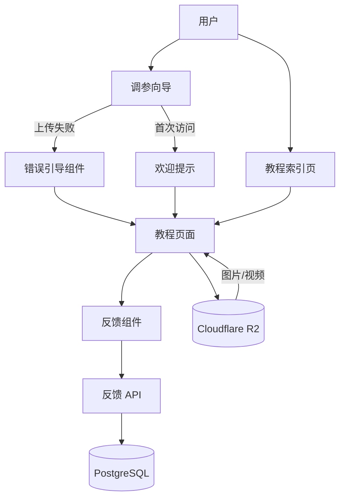

# 设计文档：文件导出教程系统

## 概述

本设计文档描述了 FPVtune 文件导出教程系统的技术实现方案。该系统旨在帮助新手用户了解如何从飞控导出 Blackbox 日志和 CLI dump 配置文件，降低使用门槛，提高用户成功率。

系统包含以下核心功能：
- 两个详细的教程页面（Blackbox 日志导出、CLI dump 导出）
- 教程索引页面，提供搜索和分类浏览
- 智能错误引导，在上传失败时提供相关帮助
- 用户反馈机制，收集教程质量数据
- 首次使用引导，帮助新用户快速上手
- 快速参考模式，为有经验用户提供简洁版本

技术栈：
- Next.js 14 App Router
- TypeScript
- next-intl（国际化）
- Tailwind CSS
- Cloudflare R2（媒体存储）
- PostgreSQL（反馈数据存储）

## 架构

### 系统架构图



### 目录结构

```
src/
├── app/
│   └── [locale]/
│       ├── guides/
│       │   ├── page.tsx                    # 教程索引页
│       │   ├── export-blackbox/
│       │   │   └── page.tsx                # Blackbox 教程页
│       │   └── export-cli-dump/
│       │       └── page.tsx                # CLI dump 教程页
│       └── api/
│           └── feedback/
│               └── route.ts                # 反馈 API
├── components/
│   ├── guides/
│   │   ├── tutorial-layout.tsx             # 教程页面布局
│   │   ├── tutorial-step.tsx               # 教程步骤组件
│   │   ├── tutorial-image.tsx              # 教程图片组件（R2）
│   │   ├── feedback-widget.tsx             # 反馈组件
│   │   ├── quick-reference-toggle.tsx      # 快速参考切换
│   │   ├── breadcrumb.tsx                  # 面包屑导航
│   │   └── search-bar.tsx                  # 搜索栏
│   ├── tune/
│   │   ├── tune-wizard.tsx                 # 现有调参向导
│   │   ├── error-guidance.tsx              # 错误引导组件（新增）
│   │   └── welcome-prompt.tsx              # 欢迎提示（新增）
│   └── ui/
│       └── ...                             # 现有 UI 组件
├── lib/
│   ├── r2-client.ts                        # R2 客户端
│   └── feedback-service.ts                 # 反馈服务
└── messages/
    ├── en.json                             # 英文翻译
    └── zh.json                             # 中文翻译
```

## 组件和接口

### 1. 教程页面组件

#### TutorialPage (Server Component)

教程页面的主容器，负责加载翻译和渲染教程内容。

```typescript
// src/app/[locale]/guides/export-blackbox/page.tsx
import { getTranslations } from 'next-intl/server';
import { TutorialLayout } from '@/components/guides/tutorial-layout';
import { TutorialStep } from '@/components/guides/tutorial-step';
import { TutorialImage } from '@/components/guides/tutorial-image';
import { FeedbackWidget } from '@/components/guides/feedback-widget';

export async function generateMetadata({ params: { locale } }) {
  const t = await getTranslations({ locale, namespace: 'Guides.exportBlackbox' });

  return {
    title: t('meta.title'),
    description: t('meta.description'),
  };
}

export default async function ExportBlackboxPage() {
  const t = await getTranslations('Guides.exportBlackbox');

  return (
    <TutorialLayout
      title={t('title')}
      description={t('description')}
      breadcrumbs={[
        { label: t('breadcrumbs.home'), href: '/' },
        { label: t('breadcrumbs.guides'), href: '/guides' },
        { label: t('breadcrumbs.current') },
      ]}
    >
      {/* 教程内容 */}
      <TutorialStep number={1} title={t('steps.1.title')}>
        <p>{t('steps.1.content')}</p>
        <TutorialImage
          src="guides/blackbox/step1.png"
          alt={t('steps.1.imageAlt')}
        />
      </TutorialStep>

      {/* 更多步骤... */}

      <FeedbackWidget tutorialId="export-blackbox" />
    </TutorialLayout>
  );
}
```


#### TutorialLayout (Client Component)

教程页面的布局组件，提供面包屑导航和快速参考模式切换。

```typescript
// src/components/guides/tutorial-layout.tsx
'use client';

import { useState, useEffect } from 'react';
import { Breadcrumb } from './breadcrumb';
import { QuickReferenceToggle } from './quick-reference-toggle';

interface TutorialLayoutProps {
  title: string;
  description: string;
  breadcrumbs: Array<{ label: string; href?: string }>;
  children: React.ReactNode;
}

export function TutorialLayout({
  title,
  description,
  breadcrumbs,
  children,
}: TutorialLayoutProps) {
  const [isQuickMode, setIsQuickMode] = useState(false);

  // 从 localStorage 读取用户偏好
  useEffect(() => {
    const saved = localStorage.getItem('tutorial-quick-mode');
    if (saved) setIsQuickMode(saved === 'true');
  }, []);

  // 保存用户偏好
  const handleToggle = (enabled: boolean) => {
    setIsQuickMode(enabled);
    localStorage.setItem('tutorial-quick-mode', String(enabled));
  };

  return (
    <div className="min-h-screen bg-[#030304] text-white">
      <div className="max-w-4xl mx-auto px-6 py-8">
        <Breadcrumb items={breadcrumbs} />

        <div className="flex justify-between items-start mt-6 mb-8">
          <div>
            <h1 className="text-4xl font-bold mb-3">{title}</h1>
            <p className="text-gray-400 text-lg">{description}</p>
          </div>
          <QuickReferenceToggle
            enabled={isQuickMode}
            onToggle={handleToggle}
          />
        </div>

        <div data-quick-mode={isQuickMode}>
          {children}
        </div>
      </div>
    </div>
  );
}
```

#### TutorialStep (Client Component)

单个教程步骤组件，支持快速参考模式。

```typescript
// src/components/guides/tutorial-step.tsx
'use client';

interface TutorialStepProps {
  number: number;
  title: string;
  children: React.ReactNode;
  isQuickOnly?: boolean; // 仅在快速模式显示
}

export function TutorialStep({
  number,
  title,
  children,
  isQuickOnly = false,
}: TutorialStepProps) {
  return (
    <div
      className="mb-8 pb-8 border-b border-white/10 last:border-0"
      data-quick-only={isQuickOnly}
    >
      <div className="flex items-start gap-4">
        <div className="w-10 h-10 rounded-full bg-blue-500 flex items-center justify-center font-bold flex-shrink-0">
          {number}
        </div>
        <div className="flex-1">
          <h3 className="text-xl font-semibold mb-3">{title}</h3>
          <div className="prose prose-invert max-w-none">
            {children}
          </div>
        </div>
      </div>
    </div>
  );
}
```

#### TutorialImage (Client Component)

教程图片组件，从 R2 加载图片并提供响应式支持。

```typescript
// src/components/guides/tutorial-image.tsx
'use client';

import Image from 'next/image';
import { useState } from 'react';

interface TutorialImageProps {
  src: string; // R2 路径，如 "fpvtune/guides/blackbox/step1.png"
  alt: string;
  caption?: string;
}

export function TutorialImage({ src, alt, caption }: TutorialImageProps) {
  const [isLoading, setIsLoading] = useState(true);

  // 构建完整的 R2 URL
  const imageUrl = `${process.env.NEXT_PUBLIC_R2_PUBLIC_URL}/${src}`;

  return (
    <figure className="my-6">
      <div className="relative rounded-xl overflow-hidden bg-white/5 border border-white/10">
        {isLoading && (
          <div className="absolute inset-0 flex items-center justify-center">
            <div className="w-8 h-8 border-2 border-blue-500 border-t-transparent rounded-full animate-spin" />
          </div>
        )}
        <Image
          src={imageUrl}
          alt={alt}
          width={800}
          height={450}
          className="w-full h-auto"
          onLoadingComplete={() => setIsLoading(false)}
        />
      </div>
      {caption && (
        <figcaption className="text-sm text-gray-500 mt-2 text-center">
          {caption}
        </figcaption>
      )}
    </figure>
  );
}
```


### 2. 反馈系统组件

#### FeedbackWidget (Client Component)

用户反馈组件，收集教程质量反馈。

```typescript
// src/components/guides/feedback-widget.tsx
'use client';

import { useState, useEffect } from 'react';
import { ThumbsUp, ThumbsDown, Send } from 'lucide-react';
import { useTranslations } from 'next-intl';

interface FeedbackWidgetProps {
  tutorialId: string;
}

export function FeedbackWidget({ tutorialId }: FeedbackWidgetProps) {
  const t = useTranslations('Guides.feedback');
  const [hasSubmitted, setHasSubmitted] = useState(false);
  const [rating, setRating] = useState<'helpful' | 'not-helpful' | null>(null);
  const [comment, setComment] = useState('');
  const [isSubmitting, setIsSubmitting] = useState(false);

  // 检查是否已提交反馈
  useEffect(() => {
    const key = `feedback-${tutorialId}`;
    const submitted = sessionStorage.getItem(key);
    if (submitted) setHasSubmitted(true);
  }, [tutorialId]);

  const handleSubmit = async () => {
    if (!rating) return;

    setIsSubmitting(true);
    try {
      await fetch('/api/feedback', {
        method: 'POST',
        headers: { 'Content-Type': 'application/json' },
        body: JSON.stringify({
          tutorialId,
          rating,
          comment: rating === 'not-helpful' ? comment : undefined,
        }),
      });

      sessionStorage.setItem(`feedback-${tutorialId}`, 'true');
      setHasSubmitted(true);
    } catch (error) {
      console.error('Failed to submit feedback:', error);
    } finally {
      setIsSubmitting(false);
    }
  };

  if (hasSubmitted) {
    return (
      <div className="bg-green-500/10 border border-green-500/20 rounded-xl p-6 text-center">
        <p className="text-green-400">{t('thankYou')}</p>
      </div>
    );
  }

  return (
    <div className="bg-white/5 border border-white/10 rounded-xl p-6">
      <h3 className="font-semibold text-white mb-4">{t('title')}</h3>

      <div className="flex gap-3 mb-4">
        <button
          onClick={() => setRating('helpful')}
          className={`flex-1 flex items-center justify-center gap-2 py-3 rounded-lg border-2 transition-all ${
            rating === 'helpful'
              ? 'border-green-500 bg-green-500/10 text-green-400'
              : 'border-white/10 hover:border-white/20 text-gray-400'
          }`}
        >
          <ThumbsUp className="w-5 h-5" />
          {t('helpful')}
        </button>
        <button
          onClick={() => setRating('not-helpful')}
          className={`flex-1 flex items-center justify-center gap-2 py-3 rounded-lg border-2 transition-all ${
            rating === 'not-helpful'
              ? 'border-red-500 bg-red-500/10 text-red-400'
              : 'border-white/10 hover:border-white/20 text-gray-400'
          }`}
        >
          <ThumbsDown className="w-5 h-5" />
          {t('notHelpful')}
        </button>
      </div>

      {rating === 'not-helpful' && (
        <textarea
          value={comment}
          onChange={(e) => setComment(e.target.value)}
          placeholder={t('commentPlaceholder')}
          rows={3}
          className="w-full bg-white/5 border border-white/10 rounded-lg px-4 py-3 text-white placeholder:text-gray-500 focus:outline-none focus:border-blue-500 resize-none mb-4"
        />
      )}

      {rating && (
        <button
          onClick={handleSubmit}
          disabled={isSubmitting}
          className="w-full flex items-center justify-center gap-2 py-3 rounded-lg bg-blue-500 hover:bg-blue-600 text-white font-medium transition-all disabled:opacity-50"
        >
          <Send className="w-4 h-4" />
          {isSubmitting ? t('submitting') : t('submit')}
        </button>
      )}
    </div>
  );
}
```

#### 反馈 API 路由

```typescript
// src/app/api/feedback/route.ts
import { NextRequest, NextResponse } from 'next/server';
import { saveFeedback } from '@/lib/feedback-service';

export async function POST(request: NextRequest) {
  try {
    const body = await request.json();
    const { tutorialId, rating, comment } = body;

    if (!tutorialId || !rating) {
      return NextResponse.json(
        { error: 'Missing required fields' },
        { status: 400 }
      );
    }

    await saveFeedback({
      tutorialId,
      rating,
      comment,
      userAgent: request.headers.get('user-agent') || undefined,
      timestamp: new Date(),
    });

    return NextResponse.json({ success: true });
  } catch (error) {
    console.error('Feedback API error:', error);
    return NextResponse.json(
      { error: 'Internal server error' },
      { status: 500 }
    );
  }
}
```


### 3. 错误引导组件

#### ErrorGuidance (Client Component)

在文件上传失败时显示相关教程链接。

```typescript
// src/components/tune/error-guidance.tsx
'use client';

import { AlertCircle, ExternalLink } from 'lucide-react';
import { useTranslations } from 'next-intl';
import Link from 'next/link';

interface ErrorGuidanceProps {
  type: 'blackbox' | 'cli-dump';
  errorMessage: string;
}

export function ErrorGuidance({ type, errorMessage }: ErrorGuidanceProps) {
  const t = useTranslations('TunePage.errorGuidance');

  const guideUrl = type === 'blackbox'
    ? '/guides/export-blackbox'
    : '/guides/export-cli-dump';

  const guideTitle = type === 'blackbox'
    ? t('blackboxGuide')
    : t('cliDumpGuide');

  return (
    <div className="bg-red-500/10 border border-red-500/30 rounded-xl p-4 mt-3">
      <div className="flex items-start gap-3">
        <AlertCircle className="w-5 h-5 text-red-400 flex-shrink-0 mt-0.5" />
        <div className="flex-1">
          <p className="text-red-400 text-sm mb-2">{errorMessage}</p>
          <Link
            href={guideUrl}
            target="_blank"
            className="inline-flex items-center gap-2 text-sm text-blue-400 hover:text-blue-300 transition-colors"
          >
            <ExternalLink className="w-4 h-4" />
            {guideTitle}
          </Link>
        </div>
      </div>
    </div>
  );
}
```

### 4. 欢迎提示组件

#### WelcomePrompt (Client Component)

首次访问调参向导时显示的引导提示。

```typescript
// src/components/tune/welcome-prompt.tsx
'use client';

import { useState, useEffect } from 'react';
import { X, FileText, Terminal, ExternalLink } from 'lucide-react';
import { useTranslations } from 'next-intl';
import Link from 'next/link';

export function WelcomePrompt() {
  const t = useTranslations('TunePage.welcome');
  const [isVisible, setIsVisible] = useState(false);

  useEffect(() => {
    const hasSeenWelcome = localStorage.getItem('tune-wizard-welcome-seen');
    if (!hasSeenWelcome) {
      setIsVisible(true);
    }
  }, []);

  const handleDismiss = (dontShowAgain: boolean) => {
    if (dontShowAgain) {
      localStorage.setItem('tune-wizard-welcome-seen', 'true');
    }
    setIsVisible(false);
  };

  if (!isVisible) return null;

  return (
    <div className="fixed inset-0 z-50 flex items-center justify-center bg-black/80 backdrop-blur-sm">
      <div className="bg-[#030304] border border-white/10 rounded-2xl p-6 max-w-lg mx-4 relative">
        <button
          onClick={() => handleDismiss(false)}
          className="absolute top-4 right-4 text-gray-500 hover:text-white transition-colors"
        >
          <X className="w-5 h-5" />
        </button>

        <h2 className="text-2xl font-bold text-white mb-3">{t('title')}</h2>
        <p className="text-gray-400 mb-6">{t('description')}</p>

        <div className="space-y-3 mb-6">
          <Link
            href="/guides/export-blackbox"
            target="_blank"
            className="flex items-center gap-3 p-4 bg-white/5 hover:bg-white/10 border border-white/10 rounded-xl transition-all"
          >
            <FileText className="w-6 h-6 text-blue-400 flex-shrink-0" />
            <div className="flex-1">
              <h3 className="font-semibold text-white">{t('blackboxTitle')}</h3>
              <p className="text-sm text-gray-500">{t('blackboxDesc')}</p>
            </div>
            <ExternalLink className="w-4 h-4 text-gray-500" />
          </Link>

          <Link
            href="/guides/export-cli-dump"
            target="_blank"
            className="flex items-center gap-3 p-4 bg-white/5 hover:bg-white/10 border border-white/10 rounded-xl transition-all"
          >
            <Terminal className="w-6 h-6 text-green-400 flex-shrink-0" />
            <div className="flex-1">
              <h3 className="font-semibold text-white">{t('cliDumpTitle')}</h3>
              <p className="text-sm text-gray-500">{t('cliDumpDesc')}</p>
            </div>
            <ExternalLink className="w-4 h-4 text-gray-500" />
          </Link>
        </div>

        <div className="flex gap-3">
          <button
            onClick={() => handleDismiss(true)}
            className="flex-1 py-3 rounded-lg bg-blue-500 hover:bg-blue-600 text-white font-medium transition-all"
          >
            {t('dontShowAgain')}
          </button>
          <button
            onClick={() => handleDismiss(false)}
            className="flex-1 py-3 rounded-lg bg-white/10 hover:bg-white/20 text-white font-medium transition-all"
          >
            {t('gotIt')}
          </button>
        </div>
      </div>
    </div>
  );
}
```


### 5. 教程索引页面

#### GuidesIndexPage (Server Component)

教程索引页面，提供搜索和分类浏览功能。

```typescript
// src/app/[locale]/guides/page.tsx
import { getTranslations } from 'next-intl/server';
import { SearchBar } from '@/components/guides/search-bar';
import { FileText, Terminal, BookOpen } from 'lucide-react';
import Link from 'next/link';

export async function generateMetadata({ params: { locale } }) {
  const t = await getTranslations({ locale, namespace: 'Guides.index' });

  return {
    title: t('meta.title'),
    description: t('meta.description'),
  };
}

export default async function GuidesIndexPage() {
  const t = await getTranslations('Guides.index');

  const guides = [
    {
      id: 'export-blackbox',
      title: t('guides.exportBlackbox.title'),
      description: t('guides.exportBlackbox.description'),
      category: 'getting-started',
      icon: FileText,
      href: '/guides/export-blackbox',
    },
    {
      id: 'export-cli-dump',
      title: t('guides.exportCliDump.title'),
      description: t('guides.exportCliDump.description'),
      category: 'getting-started',
      icon: Terminal,
      href: '/guides/export-cli-dump',
    },
  ];

  return (
    <div className="min-h-screen bg-[#030304] text-white">
      <div className="max-w-6xl mx-auto px-6 py-12">
        <div className="text-center mb-12">
          <div className="w-16 h-16 bg-blue-500/20 rounded-2xl flex items-center justify-center mx-auto mb-4">
            <BookOpen className="w-8 h-8 text-blue-400" />
          </div>
          <h1 className="text-4xl font-bold mb-3">{t('title')}</h1>
          <p className="text-gray-400 text-lg">{t('description')}</p>
        </div>

        <SearchBar />

        <div className="mt-12">
          <h2 className="text-2xl font-bold mb-6">{t('categories.gettingStarted')}</h2>
          <div className="grid grid-cols-1 md:grid-cols-2 gap-4">
            {guides.map((guide) => {
              const Icon = guide.icon;
              return (
                <Link
                  key={guide.id}
                  href={guide.href}
                  className="group p-6 bg-white/5 hover:bg-white/10 border border-white/10 hover:border-blue-500/50 rounded-xl transition-all"
                >
                  <div className="flex items-start gap-4">
                    <div className="w-12 h-12 bg-blue-500/20 rounded-lg flex items-center justify-center flex-shrink-0 group-hover:bg-blue-500/30 transition-colors">
                      <Icon className="w-6 h-6 text-blue-400" />
                    </div>
                    <div className="flex-1">
                      <h3 className="text-xl font-semibold text-white mb-2 group-hover:text-blue-400 transition-colors">
                        {guide.title}
                      </h3>
                      <p className="text-gray-400 text-sm">{guide.description}</p>
                    </div>
                  </div>
                </Link>
              );
            })}
          </div>
        </div>
      </div>
    </div>
  );
}
```

#### SearchBar (Client Component)

教程搜索组件。

```typescript
// src/components/guides/search-bar.tsx
'use client';

import { useState } from 'react';
import { Search } from 'lucide-react';
import { useTranslations } from 'next-intl';

export function SearchBar() {
  const t = useTranslations('Guides.search');
  const [query, setQuery] = useState('');

  const handleSearch = (e: React.FormEvent) => {
    e.preventDefault();
    // TODO: 实现搜索功能
    console.log('Search:', query);
  };

  return (
    <form onSubmit={handleSearch} className="max-w-2xl mx-auto">
      <div className="relative">
        <Search className="absolute left-4 top-1/2 -translate-y-1/2 w-5 h-5 text-gray-500" />
        <input
          type="text"
          value={query}
          onChange={(e) => setQuery(e.target.value)}
          placeholder={t('placeholder')}
          className="w-full bg-white/5 border border-white/10 rounded-xl pl-12 pr-4 py-4 text-white placeholder:text-gray-500 focus:outline-none focus:border-blue-500 transition-colors"
        />
      </div>
    </form>
  );
}
```

## 数据模型

### 反馈数据模型

```typescript
// src/lib/feedback-service.ts
export interface Feedback {
  id?: string;
  tutorialId: string;
  rating: 'helpful' | 'not-helpful';
  comment?: string;
  userAgent?: string;
  timestamp: Date;
}

export interface FeedbackStats {
  tutorialId: string;
  totalFeedback: number;
  helpfulCount: number;
  notHelpfulCount: number;
  helpfulPercentage: number;
  recentComments: Array<{
    comment: string;
    timestamp: Date;
  }>;
}
```

### 数据库表结构

```sql
-- 反馈表
CREATE TABLE tutorial_feedback (
  id UUID PRIMARY KEY DEFAULT gen_random_uuid(),
  tutorial_id VARCHAR(100) NOT NULL,
  rating VARCHAR(20) NOT NULL CHECK (rating IN ('helpful', 'not-helpful')),
  comment TEXT,
  user_agent TEXT,
  created_at TIMESTAMP WITH TIME ZONE DEFAULT NOW(),

  INDEX idx_tutorial_id (tutorial_id),
  INDEX idx_created_at (created_at)
);
```

### R2 存储结构

```
promptimage/
└── fpvtune/
    └── guides/
        ├── blackbox/
        │   ├── step1.png
        │   ├── step2.png
        │   ├── step3.png
        │   └── troubleshooting.png
        ├── cli-dump/
        │   ├── step1.png
        │   ├── step2.png
        │   ├── step3.png
        │   └── troubleshooting.png
        └── thumbnails/
            ├── blackbox-thumb.png
            └── cli-dump-thumb.png
```


## 正确性属性

正确性属性是关于系统应该做什么的形式化陈述。每个属性都是一个应该在所有有效执行中保持为真的特征或行为。属性是人类可读规范和机器可验证正确性保证之间的桥梁。

### 属性反思

在分析验收标准后，我识别出以下可以合并的冗余属性：

1. **媒体资源 R2 存储**：需求 9.1（截图）、9.2（视频）和 9.4（所有媒体）可以合并为一个综合属性
2. **国际化支持**：需求 3.1、3.2、11.6 和 13.7 都涉及语言切换，可以合并为一个属性
3. **响应式设计**：需求 4.1、4.2、4.3 和 4.4 都测试响应式行为，可以合并
4. **错误引导**：需求 10.1、10.2 和 10.3 都测试上传失败时的帮助链接，可以合并

### 属性列表

#### 属性 1：语言切换内容更新

*对于任何*支持的语言（中文、英文），当用户切换到该语言时，所有教程页面和组件的文本内容应该显示为该语言的翻译版本。

**验证：需求 3.1, 3.2, 11.6, 13.7**

#### 属性 2：响应式布局适应

*对于任何*视口尺寸（桌面、平板、移动），教程页面应该自动调整布局以适应该尺寸，确保内容可读且可访问。

**验证：需求 4.1, 4.2, 4.3, 4.4**

#### 属性 3：媒体资源 R2 存储

*对于任何*教程页面中的媒体资源（图片、视频），其 URL 应该指向 Cloudflare R2 存储服务，格式为 `${R2_PUBLIC_URL}/${path}`。

**验证：需求 9.1, 9.2, 9.4**

#### 属性 4：图片无障碍文本

*对于任何*教程页面中的图片元素，都应该包含描述性的 alt 属性文本以支持无障碍访问。

**验证：需求 7.4**

#### 属性 5：上传失败错误引导

*对于任何*文件上传失败（Blackbox 或 CLI dump），系统应该显示相应的教程链接和错误说明，帮助用户解决问题。

**验证：需求 10.1, 10.2, 10.3**

#### 属性 6：教程索引项完整性

*对于任何*在教程索引页面显示的教程项，都应该包含标题、描述和缩略图这三个必需元素。

**验证：需求 11.3**

#### 属性 7：反馈数据持久化

*对于任何*有效的用户反馈提交（包含 tutorialId 和 rating），系统应该将数据成功保存到数据库并返回成功响应。

**验证：需求 12.5**

## 错误处理

### 文件上传错误

```typescript
// 错误类型定义
type UploadError =
  | { type: 'invalid-format'; acceptedFormats: string[] }
  | { type: 'file-too-large'; maxSize: number }
  | { type: 'upload-failed'; message: string }
  | { type: 'parse-error'; message: string };

// 错误处理函数
function handleUploadError(error: UploadError, fileType: 'blackbox' | 'cli-dump') {
  const guideUrl = fileType === 'blackbox'
    ? '/guides/export-blackbox'
    : '/guides/export-cli-dump';

  return {
    message: getErrorMessage(error),
    guideUrl,
    showGuide: true,
  };
}
```

### API 错误处理

```typescript
// API 路由错误处理
export async function POST(request: NextRequest) {
  try {
    // 处理请求
  } catch (error) {
    if (error instanceof ValidationError) {
      return NextResponse.json(
        { error: error.message },
        { status: 400 }
      );
    }

    if (error instanceof DatabaseError) {
      console.error('Database error:', error);
      return NextResponse.json(
        { error: 'Failed to save data' },
        { status: 500 }
      );
    }

    // 未知错误
    console.error('Unexpected error:', error);
    return NextResponse.json(
      { error: 'Internal server error' },
      { status: 500 }
    );
  }
}
```

### R2 加载错误

```typescript
// 图片加载失败处理
export function TutorialImage({ src, alt }: TutorialImageProps) {
  const [error, setError] = useState(false);

  if (error) {
    return (
      <div className="bg-red-500/10 border border-red-500/30 rounded-xl p-6 text-center">
        <p className="text-red-400">图片加载失败</p>
        <p className="text-sm text-gray-500 mt-2">{alt}</p>
      </div>
    );
  }

  return (
    <Image
      src={imageUrl}
      alt={alt}
      onError={() => setError(true)}
      // ...
    />
  );
}
```


## 测试策略

### 双重测试方法

本项目采用单元测试和属性测试相结合的方法，确保全面的测试覆盖：

- **单元测试**：验证特定示例、边缘情况和错误条件
- **属性测试**：验证跨所有输入的通用属性
- 两者互补且都是必需的（单元测试捕获具体错误，属性测试验证一般正确性）

### 单元测试

单元测试专注于：
- 特定示例，演示正确行为
- 组件之间的集成点
- 边缘情况和错误条件

**不要编写过多的单元测试** - 属性测试已经处理了大量输入的覆盖。

#### 组件测试示例

```typescript
// src/components/guides/__tests__/tutorial-layout.test.tsx
import { render, screen } from '@testing-library/react';
import { TutorialLayout } from '../tutorial-layout';

describe('TutorialLayout', () => {
  it('renders breadcrumb navigation', () => {
    render(
      <TutorialLayout
        title="Test Tutorial"
        description="Test description"
        breadcrumbs={[
          { label: 'Home', href: '/' },
          { label: 'Guides', href: '/guides' },
          { label: 'Current' },
        ]}
      >
        <div>Content</div>
      </TutorialLayout>
    );

    expect(screen.getByText('Home')).toBeInTheDocument();
    expect(screen.getByText('Guides')).toBeInTheDocument();
    expect(screen.getByText('Current')).toBeInTheDocument();
  });

  it('toggles quick reference mode', () => {
    const { container } = render(
      <TutorialLayout
        title="Test"
        description="Test"
        breadcrumbs={[]}
      >
        <div>Content</div>
      </TutorialLayout>
    );

    const toggle = screen.getByRole('button', { name: /quick reference/i });
    toggle.click();

    expect(container.querySelector('[data-quick-mode="true"]')).toBeInTheDocument();
  });
});
```

#### API 路由测试

```typescript
// src/app/api/feedback/__tests__/route.test.ts
import { POST } from '../route';
import { NextRequest } from 'next/server';

describe('Feedback API', () => {
  it('saves valid feedback', async () => {
    const request = new NextRequest('http://localhost/api/feedback', {
      method: 'POST',
      body: JSON.stringify({
        tutorialId: 'export-blackbox',
        rating: 'helpful',
      }),
    });

    const response = await POST(request);
    const data = await response.json();

    expect(response.status).toBe(200);
    expect(data.success).toBe(true);
  });

  it('rejects invalid feedback', async () => {
    const request = new NextRequest('http://localhost/api/feedback', {
      method: 'POST',
      body: JSON.stringify({
        tutorialId: 'export-blackbox',
        // missing rating
      }),
    });

    const response = await POST(request);

    expect(response.status).toBe(400);
  });
});
```

### 属性测试

属性测试验证跨所有输入的通用属性。每个属性测试必须：
- 运行最少 100 次迭代（由于随机化）
- 引用其设计文档属性
- 使用标签格式：**Feature: file-export-guides, Property {number}: {property_text}**

#### 属性测试库选择

- **JavaScript/TypeScript**: 使用 `fast-check` 库
- 配置每个测试运行 100+ 次迭代

#### 属性测试示例

```typescript
// src/components/guides/__tests__/tutorial-image.property.test.tsx
import { render } from '@testing-library/react';
import { TutorialImage } from '../tutorial-image';
import fc from 'fast-check';

/**
 * Feature: file-export-guides, Property 4: 图片无障碍文本
 * 对于任何教程页面中的图片元素，都应该包含描述性的 alt 属性文本
 */
describe('Property: Image accessibility text', () => {
  it('all images have alt text', () => {
    fc.assert(
      fc.property(
        fc.string({ minLength: 1 }), // src
        fc.string({ minLength: 1 }), // alt
        (src, alt) => {
          const { container } = render(
            <TutorialImage src={src} alt={alt} />
          );

          const img = container.querySelector('img');
          expect(img).toHaveAttribute('alt', alt);
        }
      ),
      { numRuns: 100 }
    );
  });
});
```

```typescript
// src/lib/__tests__/r2-client.property.test.ts
import fc from 'fast-check';
import { getMediaUrl } from '../r2-client';

/**
 * Feature: file-export-guides, Property 3: 媒体资源 R2 存储
 * 对于任何教程页面中的媒体资源，其 URL 应该指向 Cloudflare R2
 */
describe('Property: Media resources R2 storage', () => {
  it('all media URLs point to R2', () => {
    fc.assert(
      fc.property(
        fc.string({ minLength: 1 }), // path
        (path) => {
          const url = getMediaUrl(path);
          const r2Domain = process.env.NEXT_PUBLIC_R2_PUBLIC_URL;

          expect(url).toContain(r2Domain);
          expect(url).toContain(path);
        }
      ),
      { numRuns: 100 }
    );
  });
});
```

```typescript
// src/lib/__tests__/feedback-service.property.test.ts
import fc from 'fast-check';
import { saveFeedback } from '../feedback-service';

/**
 * Feature: file-export-guides, Property 7: 反馈数据持久化
 * 对于任何有效的用户反馈提交，系统应该将数据成功保存到数据库
 */
describe('Property: Feedback data persistence', () => {
  it('all valid feedback is saved', async () => {
    await fc.assert(
      fc.asyncProperty(
        fc.record({
          tutorialId: fc.constantFrom('export-blackbox', 'export-cli-dump'),
          rating: fc.constantFrom('helpful', 'not-helpful'),
          comment: fc.option(fc.string(), { nil: undefined }),
        }),
        async (feedback) => {
          const result = await saveFeedback(feedback);

          expect(result.success).toBe(true);
          expect(result.id).toBeDefined();

          // 验证数据已保存
          const saved = await getFeedback(result.id);
          expect(saved.tutorialId).toBe(feedback.tutorialId);
          expect(saved.rating).toBe(feedback.rating);
        }
      ),
      { numRuns: 100 }
    );
  });
});
```

### 端到端测试

使用 Playwright 进行端到端测试，验证完整的用户流程：

```typescript
// e2e/guides.spec.ts
import { test, expect } from '@playwright/test';

test('user can view Blackbox export guide', async ({ page }) => {
  await page.goto('/guides/export-blackbox');

  // 验证页面加载
  await expect(page.locator('h1')).toContainText('Blackbox');

  // 验证面包屑导航
  await expect(page.locator('nav[aria-label="breadcrumb"]')).toBeVisible();

  // 验证步骤显示
  await expect(page.locator('[data-step="1"]')).toBeVisible();

  // 验证反馈组件
  await expect(page.locator('text=这个教程有帮助吗')).toBeVisible();
});

test('user can switch to quick reference mode', async ({ page }) => {
  await page.goto('/guides/export-blackbox');

  // 切换到快速参考模式
  await page.click('button:has-text("快速参考")');

  // 验证模式切换
  await expect(page.locator('[data-quick-mode="true"]')).toBeVisible();

  // 验证偏好保存
  await page.reload();
  await expect(page.locator('[data-quick-mode="true"]')).toBeVisible();
});

test('user can submit feedback', async ({ page }) => {
  await page.goto('/guides/export-blackbox');

  // 提交正面反馈
  await page.click('button:has-text("有帮助")');
  await page.click('button:has-text("提交")');

  // 验证感谢消息
  await expect(page.locator('text=感谢您的反馈')).toBeVisible();
});
```

### 测试覆盖率目标

- 单元测试：80% 代码覆盖率
- 属性测试：覆盖所有核心属性
- 端到端测试：覆盖所有主要用户流程

### 持续集成

所有测试应在 CI/CD 流程中自动运行：

```yaml
# .github/workflows/test.yml
name: Tests

on: [push, pull_request]

jobs:
  test:
    runs-on: ubuntu-latest
    steps:
      - uses: actions/checkout@v3
      - uses: actions/setup-node@v3
      - run: npm install
      - run: npm run test:unit
      - run: npm run test:property
      - run: npm run test:e2e
```
