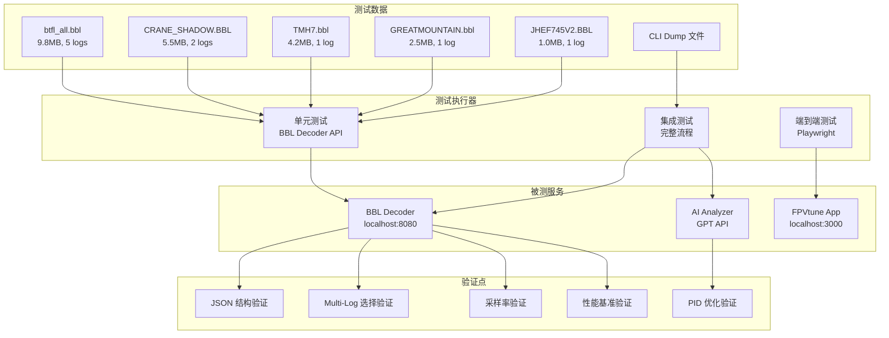

# Design Document: FPVtune BBL 解码和 AI 调参测试系统

## Overview

本设计文档描述 FPVtune BBL 解码和 AI 调参分析功能的系统化测试方案。测试系统将覆盖 BBL 解码器、多 log 处理、采样率选择、完整用户流程和 AI 分析结果质量验证。

测试采用自动化脚本 + Playwright 端到端测试的组合方式，确保功能正确性和用户体验一致性。

## Architecture



## Components and Interfaces

### 1. BBL Decoder 测试模块

负责验证 BBL 解码器的核心功能。

```typescript
interface BBLDecoderTestModule {
  // 测试单个 BBL 文件解码
  testDecode(bblPath: string): Promise<DecodeTestResult>;

  // 验证 JSON 输出结构
  validateJsonStructure(json: BBLDecodedData): ValidationResult;

  // 验证 multi-log 选择逻辑
  validateLogSelection(json: BBLDecodedData, expectedLogs: number): ValidationResult;

  // 验证采样率
  validateSampleRate(json: BBLDecodedData, minRate: number): ValidationResult;

  // 性能测试
  measureDecodeTime(bblPath: string): Promise<number>;
}

interface DecodeTestResult {
  success: boolean;
  duration_ms: number;
  output_chars: number;
  meta: {
    fw: string;
    board: string;
    duration_s: number;
    logs_found: number;
    log_used: number;
    sample_rate_hz: number;
  };
  errors?: string[];
}

interface ValidationResult {
  passed: boolean;
  message: string;
  details?: Record<string, unknown>;
}
```

### 2. AI 分析测试模块

负责验证 AI 分析结果的质量。

```typescript
interface AIAnalysisTestModule {
  // 执行完整 AI 分析流程
  runAnalysis(bblPath: string, cliPath: string, config: UserConfig): Promise<AnalysisTestResult>;

  // 验证 PID 是否为优化值（非原值复制）
  validatePIDOptimization(result: AnalysisResult, originalPID: PIDValues): ValidationResult;

  // 验证分析结果结构
  validateAnalysisStructure(result: AnalysisResult): ValidationResult;

  // 验证 CLI 命令语法
  validateCLISyntax(cliCommands: string): ValidationResult;
}

interface UserConfig {
  problems: string;
  goals: string;
  flyingStyle: string;
  frameSize: string;
  testCode: string;
}

interface AnalysisTestResult {
  success: boolean;
  duration_ms: number;
  analysis: {
    summary: string;
    issues: string[];
    recommendations: string[];
  };
  pid: PIDValues;
  cli_commands: string;
  errors?: string[];
}

interface PIDValues {
  roll: { p: number; i: number; d: number; f: number };
  pitch: { p: number; i: number; d: number; f: number };
  yaw: { p: number; i: number; d: number; f: number };
}
```

### 3. 端到端测试模块

使用 Playwright 验证完整用户流程。

```typescript
interface E2ETestModule {
  // 测试文件上传流程
  testFileUpload(bblPath: string, cliPath: string): Promise<E2ETestResult>;

  // 测试配置步骤
  testConfigurationSteps(config: UserConfig): Promise<E2ETestResult>;

  // 测试结果展示
  testResultDisplay(): Promise<E2ETestResult>;

  // 完整流程测试
  runFullFlow(testCase: TestCase): Promise<E2ETestResult>;
}

interface TestCase {
  name: string;
  bblFile: string;
  cliFile: string;
  config: UserConfig;
  expectedLogs: number;
  expectedDuration: number;
  expectedSampleRate: number;
}

interface E2ETestResult {
  passed: boolean;
  screenshots: string[];
  duration_ms: number;
  errors?: string[];
}
```

## Data Models

### 测试用例数据模型

```typescript
// 测试文件配置
const TEST_FILES: TestFileConfig[] = [
  {
    id: 'btfl_all',
    bblFile: 'public/test bll txt/btfl_all.bbl',
    cliFile: 'public/test bll txt/BTFL_cli_DARWINFPV_20260120_170512_DARWINF435.txt',
    expectedMeta: {
      logs_found: 5,
      log_used: 5,
      duration_s: 74.8,
      sample_rate_hz: 100,  // 原始采样率，可能被降采样
      min_sample_rate: 500, // 最低要求
    },
    fileSize: '9.8MB',
  },
  {
    id: 'crane_shadow',
    bblFile: 'public/test bll txt/BTFL_cli_CRANE_SHADOW O4_20260127_165659_MAMBAF722_2022B.BBL',
    cliFile: 'public/test bll txt/BTFL_cli_CRANE_SHADOW O4_20260127_165659_MAMBAF722_2022B.txt',
    expectedMeta: {
      logs_found: 2,
      log_used: 2,
      duration_s: 57.6,
      sample_rate_hz: 500,
      min_sample_rate: 500,
    },
    fileSize: '5.5MB',
  },
  {
    id: 'tmh7',
    bblFile: 'public/test bll txt/BTFL_cli_20260127_163654_TMH7.bbl',
    cliFile: 'public/test bll txt/BTFL_cli_20260127_163654_TMH7.txt',
    expectedMeta: {
      logs_found: 1,
      log_used: 1,
      duration_s: 51.5,
      sample_rate_hz: 500,
      min_sample_rate: 500,
    },
    fileSize: '4.2MB',
  },
  {
    id: 'greatmountain',
    bblFile: 'public/test bll txt/BTFL_cli_20260127_162350_GREATMOUNTAINRCF435.bbl',
    cliFile: 'public/test bll txt/BTFL_cli_20260127_162350_GREATMOUNTAINRCF435.txt',
    expectedMeta: {
      logs_found: 1,
      log_used: 1,
      duration_s: 42.1,
      sample_rate_hz: 500,
      min_sample_rate: 500,
    },
    fileSize: '2.5MB',
  },
  {
    id: 'jhef745v2',
    bblFile: 'public/test bll txt/BTFL_BLACKBOX_LOG_20260113_154353_JHEF745V2五寸竞速胶带.BBL',
    cliFile: 'public/test bll txt/BTFL_cli_20260113_154510_JHEF745V2五寸竞速胶带.txt',
    expectedMeta: {
      logs_found: 1,
      log_used: 1,
      duration_s: 12.4,
      sample_rate_hz: 1000,
      min_sample_rate: 500,
    },
    fileSize: '1.0MB',
  },
];

// 测试环境配置
const TEST_ENV = {
  BBL_DECODER_URL: 'http://localhost:8080',
  APP_URL: 'http://localhost:3000',
  TEST_CODE: 'JB_VIP_TEST',
  API_SECRET: 'fpvtune-debug-2026',
  TIMEOUT_DECODE: 30000,  // 30s
  TIMEOUT_AI: 60000,      // 60s
  TIMEOUT_E2E: 90000,     // 90s
};

// 默认用户配置
const DEFAULT_USER_CONFIG: UserConfig = {
  problems: '震动, 过冲',
  goals: '更锐利的响应, 更好的锁定',
  flyingStyle: 'freestyle',
  frameSize: '5寸',
  testCode: TEST_ENV.TEST_CODE,
};
```

### BBL 解码输出数据模型

```typescript
interface BBLDecodedData {
  meta: {
    fw: string;           // 固件版本
    board: string;        // 飞控板型号
    craft?: string;       // 机架名称
    duration_s: number;   // 飞行时长（秒）
    total_frames: number; // 总帧数
    sample_rate_hz: number; // 采样率
    points: number;       // 采样点数
    logs_found: number;   // 发现的 log 数量
    log_used: number;     // 使用的 log 索引
    segments_found?: number;
    segment_used?: string;
  };
  cli: {
    A_core: string;       // 核心配置
    B_filters: string;    // 滤波器配置
    C_controls: string;   // 控制配置
    D_context: string;    // 上下文配置
  };
  stats?: {
    gyro_rms?: { r: number; p: number; y: number };
    motor_avg?: number[];
    motor_max?: number[];
    vbat?: [number, number];
  };
  frames?: {
    t: number[];          // 时间戳
    g: number[][];        // 陀螺仪数据
    m: number[][];        // 电机数据
    sp?: number[][];      // 设定点
    rc?: number[][];      // RC 输入
  };
}
```


## Correctness Properties

*A property is a characteristic or behavior that should hold true across all valid executions of a system-essentially, a formal statement about what the system should do. Properties serve as the bridge between human-readable specifications and machine-verifiable correctness guarantees.*

### Property 1: JSON 结构完整性

*For any* valid BBL file, when decoded by BBL_Decoder, the output JSON SHALL contain all required fields: meta (with fw, board, duration_s, logs_found, log_used, sample_rate_hz), cli (with A_core, B_filters, C_controls, D_context).

**Validates: Requirements 1.1, 2.3**

### Property 2: 解码性能

*For any* BBL file of size S:
- If S < 1MB, decode time SHALL be < 5 seconds
- If 1MB <= S <= 10MB, decode time SHALL be < 30 seconds
- If S ≈ 5MB, decode time SHALL be < 15 seconds

**Validates: Requirements 1.2, 1.3, 8.1**

### Property 3: 输出大小限制

*For any* BBL file, the decoded JSON output character count SHALL NOT exceed 500,000 characters.

**Validates: Requirements 1.5**

### Property 4: 错误输入处理

*For any* invalid input (empty file, random bytes, truncated file, non-BBL format), BBL_Decoder SHALL return an error response with a non-empty error message.

**Validates: Requirements 1.4**

### Property 5: Multi-Log 识别

*For any* BBL file containing N logs (N >= 1), the decoded output meta.logs_found SHALL equal N.

**Validates: Requirements 2.1**

### Property 6: 最长 Log 选择

*For any* BBL file containing multiple logs, the decoded output meta.log_used SHALL correspond to the log with the maximum duration among all logs in the file.

**Validates: Requirements 2.2, 2.6**

### Property 7: 采样率下限

*For any* BBL file, the decoded output meta.sample_rate_hz SHALL be >= 500 Hz.

**Validates: Requirements 3.3, 3.6**

### Property 8: PID 和滤波器优化验证

*For any* AI analysis result, at least one of the following SHALL be true:
1. At least one PID value (P, I, D, or F for any axis) differs from the original configuration
2. At least one filter value (gyro_lpf, dterm_lpf, dyn_notch) differs from the original configuration
3. AI explicitly states the current configuration is already optimal (in analysis.summary)

This ensures the AI always provides actionable optimization or confirms the setup is already well-tuned.

**Validates: Requirements 5.1, 5.2**

### Property 9: 分析结果结构

*For any* successful AI analysis result:
- analysis.issues array SHALL contain 2-4 elements
- analysis.recommendations array SHALL contain 2-4 elements

**Validates: Requirements 5.3, 5.4**

### Property 10: CLI 语法验证

*For any* AI-generated CLI commands, each line SHALL match one of the valid patterns:
- `set <parameter> = <value>`
- `save`
- Comment lines starting with `#`
- Empty lines

**Validates: Requirements 5.5**

### Property 11: AI 分析性能

*For any* AI analysis request with valid input, the response time SHALL be < 45 seconds.

**Validates: Requirements 8.2**

### Property 12: 并发处理

*For any* set of up to 3 simultaneous BBL decode requests, all requests SHALL complete successfully without timeout or error.

**Validates: Requirements 8.4**

## Error Handling

### BBL Decoder 错误处理

| 错误场景 | 错误码 | 错误消息 | 处理方式 |
|---------|--------|---------|---------|
| 空文件 | 400 | "Empty file" | 返回错误，不处理 |
| 无效格式 | 400 | "Invalid BBL format" | 返回错误，不处理 |
| 文件过大 (>50MB) | 413 | "File too large" | 返回错误，不处理 |
| 解码超时 | 504 | "Decode timeout" | 返回错误，建议重试 |
| 服务不可用 | 503 | "Service unavailable" | 返回错误，建议稍后重试 |

### AI 分析错误处理

| 错误场景 | 错误码 | 错误消息 | 处理方式 |
|---------|--------|---------|---------|
| 无效测试码 | 401 | "Invalid test code" | 返回错误，拒绝请求 |
| AI 超时 | 504 | "AI analysis timeout" | 返回错误，允许重试 |
| JSON 解析失败 | 500 | "Failed to parse AI response" | 尝试从 Markdown 提取，否则返回错误 |
| 无 BBL 数据 | 400 | "No BBL data provided" | 返回错误，要求上传文件 |

### 测试中的错误断言

```typescript
// 错误响应验证
function assertErrorResponse(response: Response, expectedStatus: number, expectedMessage?: string) {
  expect(response.status).toBe(expectedStatus);
  if (expectedMessage) {
    const body = await response.json();
    expect(body.error || body.message).toContain(expectedMessage);
  }
}

// 超时验证
function assertTimeout(promise: Promise<unknown>, timeoutMs: number) {
  return expect(
    Promise.race([
      promise,
      new Promise((_, reject) => setTimeout(() => reject(new Error('Timeout')), timeoutMs))
    ])
  ).resolves.toBeDefined();
}
```

## Testing Strategy

### 测试层次

1. **单元测试**: 验证 BBL Decoder API 的基本功能
2. **集成测试**: 验证 BBL Decoder + AI Analyzer 的完整流程
3. **端到端测试**: 使用 Playwright 验证用户界面流程

### 测试框架

- **单元/集成测试**: Node.js + TypeScript
- **端到端测试**: Playwright
- **属性测试**: fast-check (用于生成随机测试输入)

### 属性测试配置

```typescript
import fc from 'fast-check';

// 每个属性测试运行 100 次迭代
const PBT_CONFIG = {
  numRuns: 100,
  verbose: true,
};

// Feature: tune-testing-prd, Property 1: JSON 结构完整性
test('Property 1: JSON structure completeness', async () => {
  await fc.assert(
    fc.asyncProperty(
      fc.constantFrom(...TEST_FILES.map(f => f.bblFile)),
      async (bblPath) => {
        const result = await decodeBBL(bblPath);
        // 验证必需字段存在
        expect(result.meta).toBeDefined();
        expect(result.meta.fw).toBeDefined();
        expect(result.meta.board).toBeDefined();
        expect(result.meta.duration_s).toBeGreaterThan(0);
        expect(result.meta.logs_found).toBeGreaterThanOrEqual(1);
        expect(result.meta.log_used).toBeGreaterThanOrEqual(1);
        expect(result.meta.sample_rate_hz).toBeGreaterThanOrEqual(500);
        expect(result.cli).toBeDefined();
        expect(result.cli.A_core).toBeDefined();
        expect(result.cli.B_filters).toBeDefined();
      }
    ),
    PBT_CONFIG
  );
});
```

### 测试用例矩阵

| 测试类型 | 测试文件 | 验证点 | 预期结果 |
|---------|---------|--------|---------|
| 单元测试 | btfl_all.bbl | logs_found | 5 |
| 单元测试 | btfl_all.bbl | sample_rate_hz | >= 500 |
| 单元测试 | CRANE_SHADOW.BBL | logs_found | 2 |
| 单元测试 | TMH7.bbl | logs_found | 1 |
| 单元测试 | GREATMOUNTAIN.bbl | logs_found | 1 |
| 单元测试 | JHEF745V2.BBL | logs_found | 1 |
| 单元测试 | JHEF745V2.BBL | sample_rate_hz | 1000 |
| 集成测试 | 任意文件 + CLI | PID 优化 | PID 值有变化 |
| 集成测试 | 任意文件 + CLI | issues 数量 | 2-4 |
| E2E 测试 | JHEF745V2.BBL | 完整流程 | 成功展示结果 |

### 测试执行命令

```bash
# 运行所有测试
pnpm test:tune

# 运行单元测试
pnpm test:tune:unit

# 运行集成测试
pnpm test:tune:integration

# 运行端到端测试
pnpm test:tune:e2e

# 运行属性测试
pnpm test:tune:property
```

### 测试报告

测试完成后生成以下报告：

1. **测试结果摘要**: 通过/失败数量、覆盖率
2. **性能报告**: 各文件解码时间、AI 分析时间
3. **截图**: E2E 测试的关键步骤截图
4. **错误日志**: 失败测试的详细错误信息

